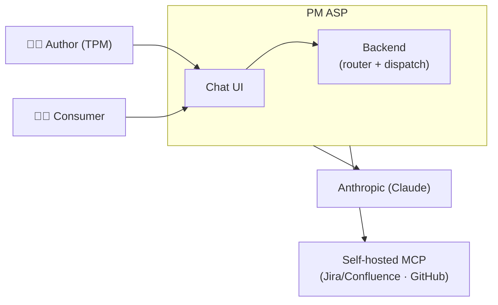
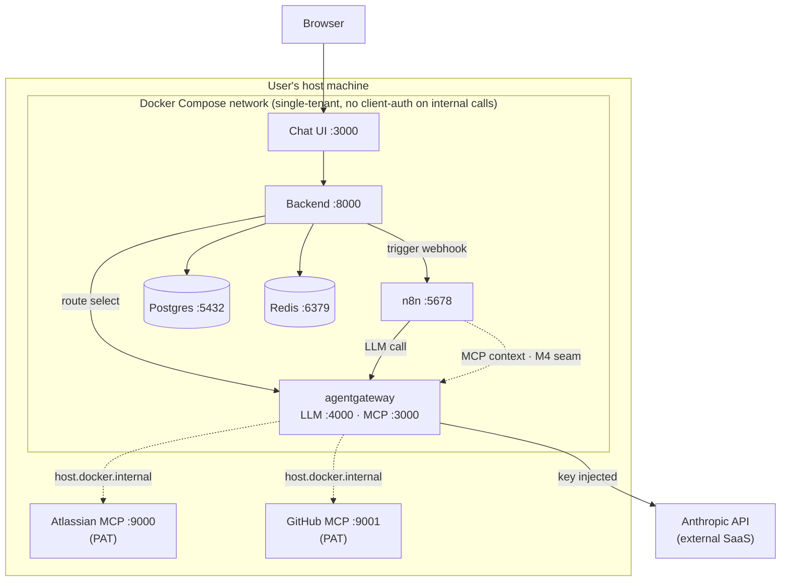
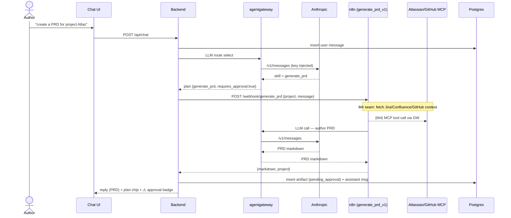
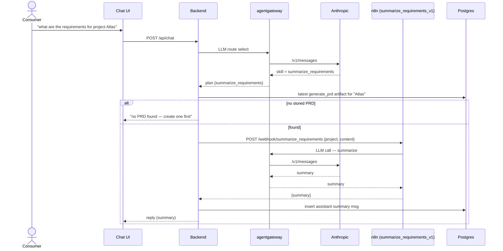
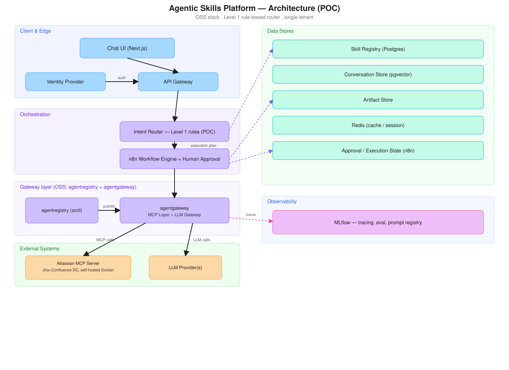

# PM ASP — Architecture

Architecture reference for the **Product Management Agentic Skills Platform** POC. It is
written around a [FINOS **CALM**](https://calm.finos.org/) (Common Architecture Language
Model) model so the architecture is machine-readable, diffable, and tool-validatable — with
human-facing views (component + sequence diagrams) generated from the same node/relationship
set.

- **Machine-readable model:** [`architecture/pm-asp.calm.json`](architecture/pm-asp.calm.json)
  — nodes, relationships, flows, and controls. Validate/visualize with the FINOS `calm` CLI
  (`npx @finos/calm-cli validate -p architecture/pm-asp.calm.json`).
- **Single source of truth for decisions:** [`CLAUDE.md`](CLAUDE.md) and the
  [Notion PRD "PM ASP v1"](https://app.notion.com/p/39f975d326ba81c2995cf380e9afb06c).
  This doc is the architecture *view*; it does not re-litigate decisions.
- **PRD source material** — the original requirements and the design-time architecture
  diagram — is captured in **[§10 Appendix A](#10-appendix-a--prd-source-notion)**.
- **How to run:** [`README.md`](README.md).

> Scope: the **runnable POC** (M1–M3 vertical slice). Deferred components (MLflow,
> agentregistry publishing, RLS/multi-tenancy) appear in §7 Roadmap but are intentionally
> absent from the CALM model until built.

---

## 1. System context

An AI-native platform for enterprise product/engineering work: a conversational interface
backed by a catalog of reusable **skills**, executed through orchestrated workflows with
human approval where needed, grounded in enterprise knowledge, producing real documents.

**Core domain objects** (shared language across code, schema, docs): Skills, Workflows,
Intents, Context, Artifacts, Executions.

---

## 2. Building blocks (CALM nodes)

| Node | Type | Responsibility | Key interface |
|---|---|---|---|
| Author / Consumer | actor | Create a PRD / query requirements | — |
| **Chat UI** | webclient | Next.js chat surface; renders markdown, plan chip, approval badge | `:3000` |
| **Backend** | service | API gateway + **LLM intent router** (Level-1 fallback) + **skill dispatcher** + persistence | `:8000` |
| **agentgateway** | service | Single endpoint: **LLM gateway** (Anthropic) + **MCP router**; injects the upstream key | LLM `:4000`, MCP `:3000` |
| **n8n** | service | **Workflow engine** — runs `generate_prd_v1`, `summarize_requirements_v1`; owns approval state (M5) | webhook `:5678` |
| **Postgres + pgvector** | database | Skill Registry (seed) · Conversation Store · Artifact Store | `:5432` |
| **Redis** | database | Session cache (`session:{id}`) | `:6379` |
| **Anthropic** | system | External LLM provider (reached only via agentgateway) | `api.anthropic.com` |
| **Atlassian MCP** | service | Self-hosted Jira+Confluence MCP (PAT) — one credential boundary | host `:9000` |
| **GitHub MCP** | service | Self-hosted GitHub MCP (PAT) — separate boundary | host `:9001` |

The **backend** deliberately fuses three logical roles the PRD names separately (API
Gateway, Intent Router, Skill Runtime) into one FastAPI service for the POC; they are
separable at M3+ without changing the router's execution-plan contract.

---

## 3. Infrastructure / deployment view

- **Local dev:** Docker Compose (`docker-compose.yml`). **Production target:** Kubernetes /
  Helm (same registry data both places — an NFR driver for agentregistry/agentgateway).
- **Trust boundaries** (solid = built, dashed = M4 seam):
  1. **Browser ↔ Backend** — CORS-scoped to the frontend origin.
  2. **Compose network** — internal services trust each other; agentgateway has **no
     client-side auth** here because it is only reachable internally (RBAC/JWT ship in
     agentgateway OSS and are turned on at **M9**).
  3. **Credential boundaries** — one MCP server per credential/trust domain: the
     **Atlassian PAT** and **GitHub PAT** live *with their servers* on the host; the
     **Anthropic key** lives only in agentgateway's env. The backend and n8n hold **no**
     provider secrets.

---

## 4. Runtime views — the two journeys (CALM flows)

### Journey 1 — Author generates a PRD (`flow-generate-prd`)

### Journey 2 — Consumer queries requirements (`flow-summarize-requirements`)

**Offline fallback (dev):** with `OFFLINE_MODE=1` the router is Level-1 keyword matching and
the skill runtimes are canned — the same flow shape runs with **no** Anthropic/MCP/n8n
dependency, for CI and demos.

---

## 5. Data architecture

Postgres DDL: [`schema.sql`](schema.sql). Redis conventions: [`redis-key-patterns.md`](redis-key-patterns.md).

| Store | Tables / keys | Notes |
|---|---|---|
| Skill Registry | `skills` | Seeded to match `skills/*.skill.json`; the router reads the JSON files today (M6 moves it to this table). |
| Conversation Store | `conversations`, `messages` | `messages.embedding VECTOR(1536)` is a placeholder (M2). Memory ≠ approval state — separate concerns, separate stores. |
| Artifact Store | `artifacts` | One row per version — never overwrite; new version, mark old `superseded`. Inline `content` for markdown, `storage_url` for blobs. Linked to `skill_name` + `conversation_id` only. |
| Session cache | `session:{id}` (Redis) | 24h sliding. `stream:*`, `approvals:pending`, `ratelimit:*`, `router:cache:*` are documented seams. |

**Deliberate omissions** (decisions, not oversights): **no `executions` table** (n8n owns
approval mechanics; an outcome log is a maybe for M5/M9) and **no `tenant_id`** anywhere
(multi-tenancy deferred to M9).

---

## 6. Cross-cutting concerns

| Concern | POC position | Milestone to revisit |
|---|---|---|
| **AuthN/AuthZ** | Basic; agentgateway internal-only. RBAC/JWT available in agentgateway OSS. | M9 |
| **Secrets** | Provider keys/PATs held only at their trust boundary (agentgateway env; MCP servers). | M9 (secrets mgmt) |
| **Human approval** | `requires_approval` surfaced as a badge; enforcement via n8n wait node. | M5 |
| **Observability (LLM)** | Not wired. MLflow (OTel tracing, eval, Prompt Registry) planned — **not** MLflow's AI Gateway. | M8 |
| **Observability (workflow)** | n8n execution log. | M8 |
| **Streaming** | Non-streaming replies. `stream:{execution_id}` buffer reserved. | M2 |
| **Versioning** | Skills versioned in the registry; prompt versioning → MLflow Prompt Registry. | M8 |
| **Multi-tenancy** | Single-tenant; no `tenant_id`/RLS. | M9 |
| **Resilience** | Router falls back to Level-1 on LLM failure; Redis session writes are best-effort; n8n retries/error handling. | M5 |

---

## 7. Architecture decisions (ADR summary)

Full rationale in [`CLAUDE.md`](CLAUDE.md). Decisions revised during the POC are flagged.

| # | Decision | Status |
|---|---|---|
| 1 | **Intent Router** | **Revised** — now LLM-based (was Level-1-only); Level-1 kept as offline/fallback. Execution-plan contract `{skill, context_sources, requires_approval, status, candidates}` unchanged. |
| 2 | MCP boundary = credential/trust domain, not product name | Settled |
| 3 | Atlassian is self-hosted DC (PAT); **GitHub MCP added** as a second source | Extended |
| 4 | Approval state lives in n8n, not Postgres (no `executions` table) | Settled |
| 5 | Multi-tenancy deferred to M9 (edge-only vs. RLS + per-tenant MCP scoping) | Deferred |
| 6 | agentregistry Enterprise vs OSS — procurement question | Deferred |
| + | **agentgateway stood up now** (M1) as LLM + MCP endpoint | New (this POC) |
| + | **Second skill** `summarize_requirements` for the Consumer journey | New (this POC) |

---

## 8. Known seams & roadmap

**Seams in the POC** (wired-but-incomplete, clearly marked):
- **MCP context fetch** inside `n8n/generate_prd_v1.json` (sticky note) — depends on the
  user's running MCP servers; until added, PRDs are LLM-authored from the prompt.
- **Approval enforcement** — badge only; no n8n wait node yet.

**Milestones:** M1 Foundation ✅ · M2 Chat→LLM streaming/history · M3 First skill ✅
(this slice) · M4 Enterprise context (real MCP) · M5 Workflow orchestration + approvals ·
M6 Skill registry as a service · M7 Router v2 (semantic/pgvector) · M8 Full telemetry
(MLflow) · M9 Enterprise readiness (RBAC, multi-tenancy/RLS, secrets) · M10 Platform
expansion.

---

## 9. Operability

- **Health:** `GET /health` (Postgres + Redis + gateway reachability). Compose healthchecks
  on postgres/redis/n8n gate startup order.
- **Failure modes:** LLM/gateway down → router degrades to Level-1 keyword matching; n8n
  webhook 404 → re-publish workflows (`publish:workflow --id=`); MCP servers down → PRD
  authored from prompt context only.
- **Ports (host):** UI `3000`, backend `8000`, n8n `5678`, agentgateway LLM `8080`/MCP
  `8081`/admin `15000`, Postgres `5432`, Redis `6379`.

---

## 10. Appendix A — PRD source (Notion)

Primary-source material from the design doc:
[**Notion — "PM ASP v1"**](https://app.notion.com/p/39f975d326ba81c2995cf380e9afb06c).
Reproduced here so the repo is self-contained. Where the PRD and this build differ, the
build wins and the delta is noted below.

### A.1 Design-time architecture diagram (as-designed)

> Source: Notion PRD §5.10. Flow: Chat UI → API Gateway → Intent Router (Level 1 rules) →
> n8n (+ human approval) → agentgateway (MCP Layer + LLM Gateway, published/curated via
> agentregistry) → self-hosted Atlassian MCP server and LLM provider. Postgres/pgvector/
> Redis form the data layer; MLflow handles LLM-side observability.

**As-designed → as-built deltas** (the §3–§4 diagrams above are authoritative for what runs):

| Aspect | PRD diagram (as-designed) | This build (as-built) |
|---|---|---|
| Intent Router | Level 1 rules only | **LLM-based** router; Level 1 is the offline/fallback (decision 1, revised) |
| MCP sources | Atlassian only | Atlassian **+ GitHub** (decision 3, extended) |
| agentgateway | shown, via agentregistry publishing | **stood up now**; `arctl`/agentregistry publishing not yet wired |
| MLflow, Identity Provider | shown | not built (M8 / basic-auth-only) — shown for target state |
| Skills | one (`generate_prd`) | two (`generate_prd`, `summarize_requirements`) |

### A.2 Business requirements (PRD §2)

Conversational interface · Skill catalog · Skill execution · Human approval steps ·
Enterprise knowledge access · Document generation · Conversation memory.

### A.3 Technical requirements — component roles (PRD §3)

| Component | Role | Mapped to (this build) |
|---|---|---|
| Chat UI | User-facing conversational surface | `chat-ui` (Next.js) |
| API Gateway | Entry point, auth, routing | `backend` (FastAPI) |
| Intent Router | Maps message + context → skill + execution plan | `backend` (LLM router) |
| Skill Registry | Catalog of skills + required context | `skills/*.json` (+ seeded `skills` table) |
| Skill Runtime | Executes a chosen skill | `backend` dispatch → n8n workflow |
| n8n Workflow Engine | Orchestrates multi-step workflows | `n8n` |
| MCP Layer | Standardized access to enterprise systems | `agentgateway` → Atlassian/GitHub MCP |
| LLM Gateway | Unified access to LLM(s) | `agentgateway` (Anthropic) |
| Artifact Store | Generated documents/outputs | `artifacts` (Postgres) |
| Conversation Store | Chat/session history | `conversations`/`messages` (Postgres) |
| Identity Provider | Auth/identity | deferred (M9) |

### A.4 Non-functional requirements (PRD §4)

Modular, plug-in architecture · Docker Compose (dev) / Kubernetes (prod) · Multi-tenant
(M9) · Secure handling of enterprise credentials · Streaming responses (M2) · Versioning
for skills and prompts (M8) · Observability for workflow execution and LLM behaviour (M8).
See §6 for where each lands in this build.

### A.5 Intent-router maturity levels (PRD §5.1)

| Level | Behaviour | This build |
|---|---|---|
| 1 | Rules-based (keyword → skill) | present as fallback (`intent_router.py`) |
| 2 | Match against the skill registry (semantic) | M7 (pgvector) |
| 3 | Planner — multi-task execution plans, orchestrated by n8n | long-term, not in POC |

> Note: the POC uses an **LLM** for matching (a pragmatic Level-1.5) rather than the PRD's
> rules-then-embeddings path — a decision made this build. Level 3 remains out of scope.

