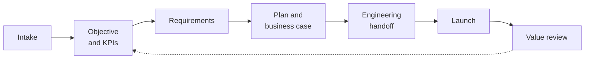

# The Value Spine — domain layer

> Status: **proposed**, not built. This document introduces a domain layer above the
> existing skill-execution stack. Nothing in `backend/`, `n8n/` or `skills/` implements it
> yet. It exists so the POC's next phase has a settled target, and so `CLAUDE.md`,
> `ARCHITECTURE.md` and `schema.sql` stop being the only definition of the product.

## Why this exists

The POC answers *how a piece of product work gets done*: a user asks, the router picks a
skill, a workflow runs, an artifact lands in Postgres. It does not answer *what the work
was for, in what order it should happen, or what it turned out to be worth*.

Today a generated PRD is an orphan. It has a `skill_name` and a `conversation_id`, and
nothing else. It cannot tell you which line of business asked for it, which KPI it was
supposed to move, or whether it moved it. That missing thread is the product.

The value spine is that thread: **customer need → committed KPI → delivery → proven
result**, carried by a first-class `initiative` object, with Jira as the system of record
underneath and the TPM never opening Jira directly.

## Core domain objects (additions)

`CLAUDE.md` names six shared objects: Skills, Workflows, Intents, Context, Artifacts,
Executions. This layer adds five more, and they are the ones an executive cares about:

| Object | What it is |
|---|---|
| **Line of business** | The internal team the work is for. Almost never an external customer. Carries stakeholders and a running value ledger. |
| **Initiative** | The unit of product work, from intake to proven value. Backed by a Jira initiative the TPM never sees. |
| **Objective / Key result** | The OKR ladder. An objective holds several key results; a key result is a KPI with a unit, a baseline and a target. |
| **Stage** | One step of the prescriptive lifecycle, owned by a human or delegated to an agent, with acceptance criteria. |
| **Value result** | What an initiative turned out to be worth, evidenced quantitatively, qualitatively, or both. |

## The lifecycle

Seven stages, the same artifacts produced every time.



The flow branches once, at intake: **new** or **enhancement**. An enhancement names a
parent initiative and inherits its objective, key results and stakeholders, so classifying
early costs the TPM less work rather than more. Stages a given initiative does not need are
hidden, not deleted; the sequence itself is fixed.

### How stages relate to skills

This is the join between the two layers, and it is the point of the whole integration.

A stage is **what must be true** before an initiative advances. A skill is **one way to
make it true**. `generate_prd` stops being a thing a user summons by typing and becomes the
default implementation of the Requirements stage; `summarize_requirements` becomes a way to
read an initiative's context back out.

That means a stage row carries an optional `skill_name`, and the existing router contract
`{skill, context_sources, requires_approval, status, candidates}` is unchanged. The router
keeps doing exactly what it does. What changes is that its result now lands *somewhere* —
on a stage, on an initiative — instead of floating in a conversation.

It also means chat is no longer the only entry point. A TPM working through the flow clicks
into the Requirements stage and the same skill runs, with the initiative as context rather
than a typed sentence.

## Measurement

A key result declares how it can be measured, because access to data is uneven:

- **Quantitative** — the number is reachable from a system we can query. Pull it.
- **Qualitative** — the number lives inside another business team we have no access to.
  Capture it through a structured stakeholder interview instead.
- **Both** — pull what we can, interview for the rest.

The qualitative path is not a consolation prize. When an engineering team builds an AI
service for a business team, the downstream sales or productivity data belongs to that
team. A named, dated statement from that team's owner is the value evidence, and it is
defensible precisely because it is attributed. Evidence rows carry the stakeholder, the
date, the question asked and the statement given.

At the value review the platform suggests the interview questions. That is what turns
"did this work?" into a repeatable assessment rather than a vibe.

## The ledger

Every published value result rolls up:

```
initiative → key result → objective → line of business → reported segment performance
```

The line of business ledger is the deliverable that does not exist today: a running record
of everything delivered for Wealth Management, or Capital Markets, and what each piece was
worth. That is the artifact worth showing an executive.

## Agent delegation and evaluation

Standardization is the precondition for delegation, not a separate goal. A stage that is
defined, scoped and measurable is a stage an agent can be handed. An undefined one is not.

So every stage carries `owner_kind` (`human` or `agent`) and `acceptance_criteria`. When an
agent completes a stage, its output is checked against those criteria before the initiative
advances, and anything below the bar routes to a human. Pass rate per stage type is what
decides whether a stage graduates from human to agent. This is deliberately stricter than
the existing `requires_approval` flag, which asks only whether a human should look, not
whether the output was any good.

Per decision 4 in `CLAUDE.md`, n8n still owns approval mechanics. Acceptance criteria are a
different thing: an evaluation contract on the output, not a gate on the run.

## Governance

Each stage declares the data it touches and that data's sensitivity. Agent-owned stages are
constrained to what they are cleared for. This extends decision 2 (MCP server boundary =
credential/trust domain) from the connection level down to the step level: knowing that the
Atlassian MCP server holds a PAT is not the same as knowing that this particular stage is
allowed to read client data.

In a bank this is the difference between something deployable and something that demos.

## Capacity

Because every initiative's plan stage carries resourcing, allocations aggregate across the
portfolio into two answers:

1. **Backward** — how utilized is the team right now, and which line of business is
   consuming it.
2. **Forward** — if this new demand arrives, can we take it, and what does saying yes cost
   elsewhere.

The second is the valuable one, and it belongs at intake: the moment a line of business
raises a need, before anything is committed. A qualified go ("yes, but initiative B slips
three weeks") is more useful than a gate.

## What this does not change

- The router's execution-plan contract.
- n8n as the owner of approval state. No `executions` table appears here.
- Single-tenancy. No `tenant_id` in the proposed tables; M9 still owns that.
- The MCP credential-boundary rule.

## Open questions

1. **Sequencing.** Is the value spine the right next bet, ahead of finishing M4/M5? The
   argument for: it is the thing nobody else provides and the thing that sells the platform
   internally. The argument against: it adds a domain layer on top of seams that are still
   open.
2. **Jira as system of record.** The design assumes every initiative is a Jira initiative
   written through MCP and never seen directly by the TPM. That makes Jira a write target,
   not just a context source, which the current MCP setup does not yet do.
3. **Where the stage definitions live.** A `stage_templates` table, or static JSON like
   `skills/` today, with M6 moving both into Postgres at once.
